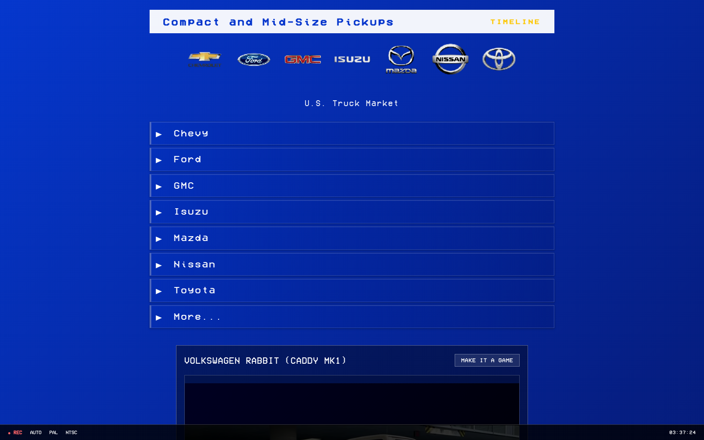

# Compact Pickup

A catalog of compact and mid-size pickup trucks sold in the U.S., styled like an old VHS recording. It started as a React class project and grew into a full Next.js app with a CMS.

Live at [compactpickup.vercel.app](https://compactpickup.vercel.app).



## What it does

- The home page is a manufacturer menu (Chevy, Ford, GMC, Isuzu, Mazda, Nissan, Toyota and more) with an image carousel and a running clock in the VHS-style status bar.
- `/[manufacturer]` lists a maker's trucks and `/[manufacturer]/[model]` shows a single model.
- `/timeline` walks through the models by year.
- Model pages include a 3D model viewer built with React Three Fiber.
- Manufacturers and truck models are stored in Sanity. The studio is in `sanity/` and is separate from the site.

## Stack

Next.js 15, React 19, TypeScript, Tailwind CSS 4, Sanity, React Three Fiber and drei, deployed on Vercel.

## Running it locally

```sh
npm install
npm run dev
```

Open http://localhost:3000. The Sanity project id and dataset are set in `src/lib/sanity.ts` and the data is public, so the site runs without any environment variables.

To work on the content models, run the studio with `npm run studio:dev`. `npm run studio:build` and `npm run studio:deploy` build and deploy it. Other scripts are `npm run build`, `npm run start` and `npm run lint`.

## Layout

```
src/app/              pages (home, [manufacturer], timeline)
src/components/       ImageCarousel and the 3D truck viewer
src/lib/sanity.ts     Sanity client and queries
sanity/               studio and schemas
```
